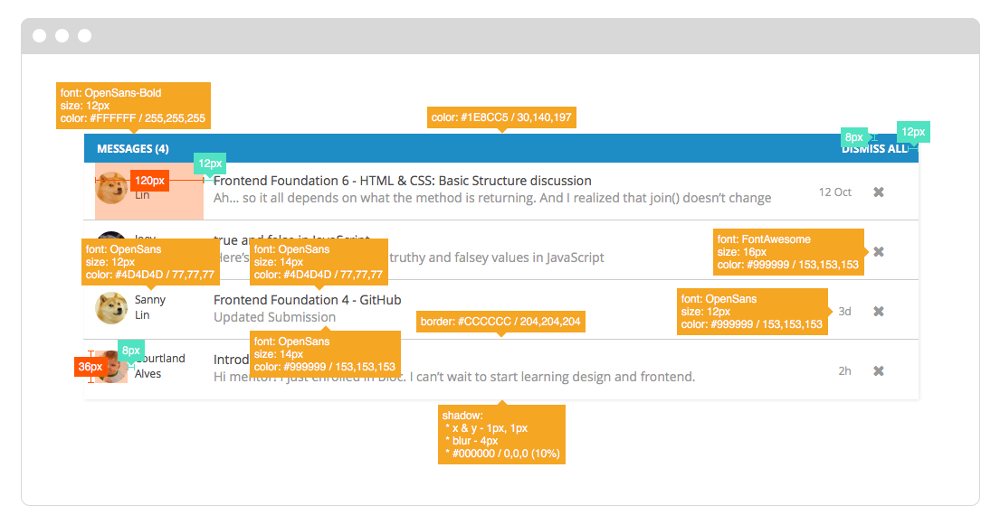
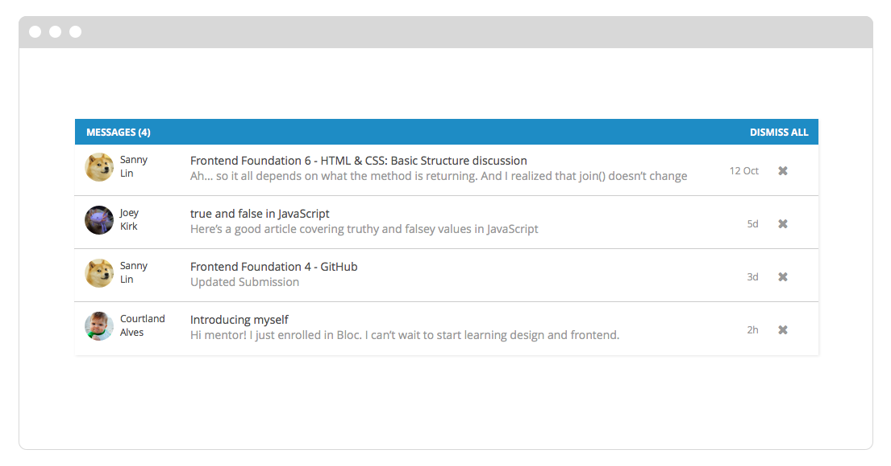
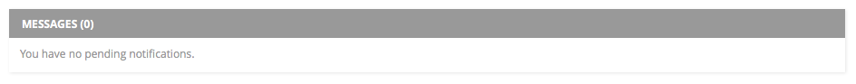

## Frontend Exercise
#### Objet
Le but de cet exercice est de comprendre si vous seriez à l'aise de prototyper votre propre travail de conception  (sauf que la conception a déjà été faite dans ce cas). Nous évaluons le potentiel plutôt que l'exactitude de la mise en œuvre, mais nous attendons des preuves de bonnes pratiques de développement.

. Selon l'endroit où vous êtes dans le programme du FullStackJS et la mesure dans laquelle vous avez pratiqué, il se peut que vous ne soyez pas en mesure d'accomplir toutes les tâches dans un délai raisonnable. Ce n'est pas grave. Cet exercice se veut un défi. Faites de votre mieux et nous vous encourageons à chercher de l'information et des ressources.

#### Quelques notes
Tout ce dont vous avez besoin devrait se trouver dans ce README ou dans ce référentiel. Nous vous encourageons à proposer et à mettre en œuvre vos propres solutions pour des exigences de fonctionnalités floues ou ouvertes.

Prévoyez deux heures consécutives pour travailler sur cet exercice de façon autonome. Vous ne devriez pas demander de l'aide ,   nous vous encourageons à utiliser à google.

#### L'exercice
Lorsque votre mentor se connecte, il voit un tableau de bord des notifications relatives à ses étudiants. Lorsque les mentors cliquent sur un message de notification, ils sont dirigés vers la page du fil de discussion du message. Votre défi est de créer un prototype des notifications de messages sur le tableau de bord du mentor en utilisant HTML, CSS, JavaScript et jQuery.

Un concepteur vous a donné les spécifications de conception fantaisie et visuelle suivantes :

**Votre tâche est de:**.

**1. Recréer le design donné en HTML et CSS.**
Vous pouvez supposer que les dimensions et les marges sont un multiple de `4px` si elles ne sont pas appelées.

**2. Ajoutez les interactions suivantes:**
Ajouter des états de `hover` à chaque élément interactif.
Permet à l'utilisateur de rejeter une notification individuelle (X) ou un lot de notifications (DISMISS ALL) et de mettre à jour l'interface utilisateur en temps réel.
Afficher un compte des notifications en attente dans l'en-tête et mettre à jour le comptage en temps réel lorsque les notifications sont rejetées.

**3. Étirez vos objectifs (ne le faites que si vous avez du temps supplémentaire !):**

S'il n'y a pas de notifications, l'état vide devrait ressembler à ceci :
 
- Utiliser le `JS` pour charger dynamiquement le contenu fourni dans la variable `data`.
- Ajouter des animations de transition au chargement et au rejet des notifications.
- Proposer un design responsive (si possible).
- Proposer et mettre en œuvre des fonctionnalités supplémentaires et des améliorations.

Ce qui précède est une suggestion d'étapes à suivre, mais vous n'êtes pas obligé de les compléter dans l'ordre. 

#### Soumettre votre exercice
`Forker` & `Cloner` ce repo. Il inclut des fichiers de démarrage et des ressources utiles.

Essayez de mettre en œuvre la plus grande partie possible de l'exercice, mais limitez-vous à une demi-journée. Après ce laps de temps, arrêtez-vous et effectuer un commit de votre travail. Envoyez-le  à votre *FORMATEUR* via github et un lien vers votre repo.

Nous vous répondrons dans les plus brefs délais. Nous vous encourageons à ne pas rager  :smiling_imp:

